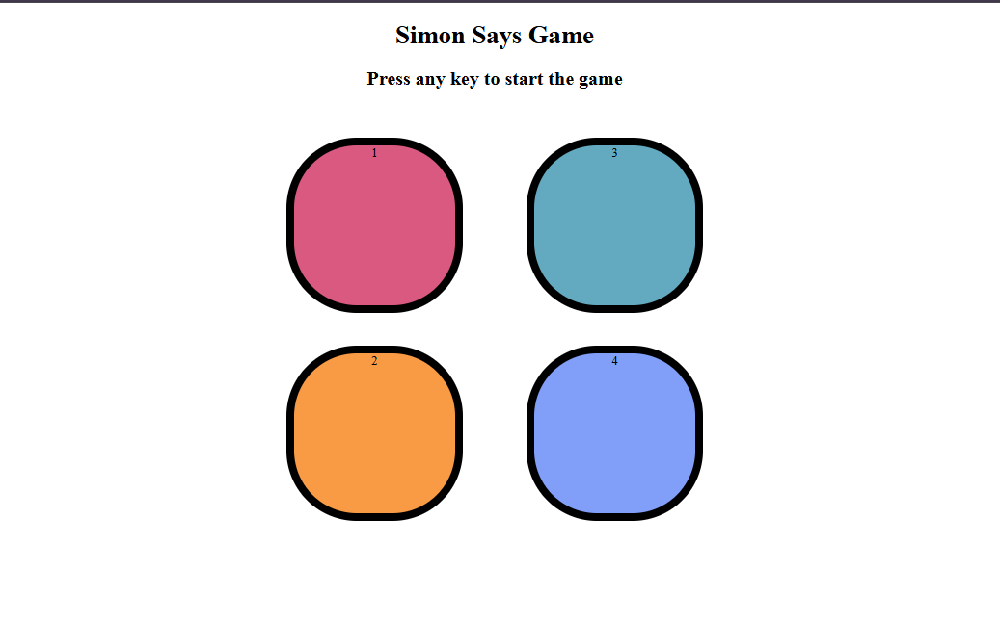

# 🎮 Simon Says Game

An interactive memory-based Simon Says Game built using **HTML, CSS, and JavaScript**. The game challenges players to remember and repeat an increasingly long sequence of colors.

## 🚀 Live Demo

🔗 https://agarwalmanish3922-code.github.io/simon-memory-game/

## 🚀 Features

- Start the game with any key press
- Random color sequence generation
- Level-by-level progression
- Visual button flash effects
- User input validation
- Game Over detection
- Restart functionality

## 🛠️ Technologies Used

- HTML5
- CSS3
- JavaScript (DOM Manipulation)

## 📸 Preview



## 🎯 How to Play

1. Press any key to start the game.
2. Watch the button that flashes.
3. Click the buttons in the same order.
4. Each level adds a new color to the sequence.
5. If you click the wrong button, the game ends.
6. Press any key to restart and try again.

## 🧠 Concepts Practiced

- DOM Manipulation
- Event Handling
- Arrays
- Random Number Generation
- Game Logic
- State Management
- CSS Animations

## 📂 Project Structure

```text
simon-says-game/
│
├── index.html
├── style.css
├── app.js
├── preview.png
└── README.md
```

## 🔧 Installation

Clone the repository:

```bash
git clone https://github.com/your-username/simon-says-game.git
```

Open the project folder:

```bash
cd simon-says-game
```

Run the application by opening:

```text
index.html
```

in your browser.

## 🌟 Future Improvements

- Add sound effects
- Add high score tracking
- Store scores using Local Storage
- Mobile-friendly controls
- Dark mode support

## 👨‍💻 Author

**Manish Agarwal**

GitHub: https://github.com/agarwalmanish3922-code

---

⭐ If you like this project, consider giving it a star!